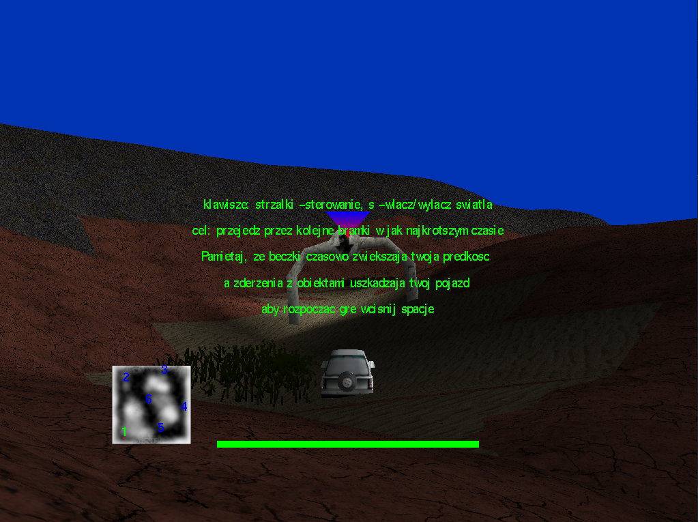
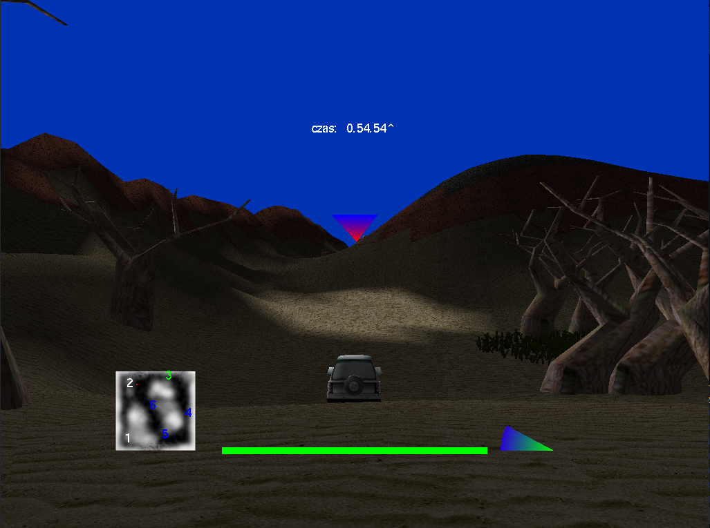

# Prototype of 3D game written in OpenGL
## Description
This is an old (2009? 2010?) project, written to complete a course in computer graphics. A 3D game, where the player can drive a car over 3D terrain with rudimentary controls, hud and objectives (player should go through gates in a pre-set order). Written in `C` and `OpenGL` (freeglut) with the use of `gd` library for image manipulations, models rendered and textured in *Wings3D* and uploaded with `glm` library. I had to slightly modify `glm` to use `gd` library for uploading texture files. Some features included:

* The terrain is automatically generated from `terrain.png` file, where grey level=height. Using a different image results in a different terrain. Terrain texturing depends on height, low altitutde has sand texture and higher are rocks.
* The very basic system of collisions (damage) and power-ups (barrels :) ) is implemented
* Hud displays a small map where passed gates are greyed-out and the next gate is highlighted, there is also speed-meter and an arrow pointing to the active objective

  
   

## Program structure

The program functions in the following way. In `main()`, first, program sets all parameters by calling function `set_beginning()`, then it enters the main display loop. In this loop the functions `display()`, `animate()`, `keyboard()`, `spec_keys()` are repeatedly called. `Display()` is called to generate each frame, `animate()` is called periodically, updating objects positions and checking for e.g. collisions, `keyboard()` and `spec_keys()` detect the change in the keyboard buffer. 

## Files:
* `main.c`: main program file, begins with the allocation of all necessary textures and models, defines `display()`, `animate()` and other important functions used in `main()` and in main display loop, then frees the the resources. 
* `move.h`, `move.c`: functions related to movement and collisions
* `model_fun.h`, `model_fun.c`: general functions for drawing 3d models
* `env_model.c`: functions for rendering the terrain and particular models (trees, gates, grass, barrels) at pres-set positions
* `tex_tools.c`: utility functions to upload textures
